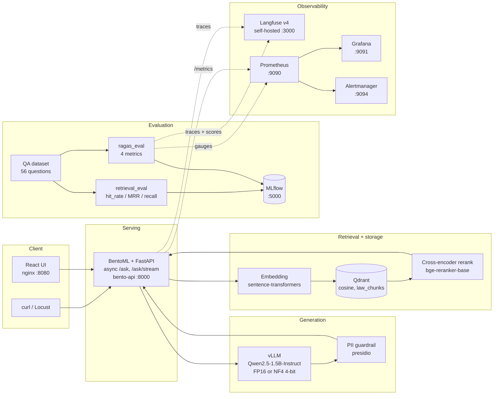

# Legal-RAG

Retrieval-augmented QA over the **Egyptian Civil Code**. Ingestion and evaluation
run in containers; the generative model is served by vLLM on a single GPU.

The RAG path is: question → query embedding → Qdrant cosine search → cross-encoder
rerank → citation-grounded prompt → vLLM generation → PII guardrail → answer, with
every step traced in Langfuse and scored by Ragas.

---

## Quickstart

```bash
# 1. configure — copy .env.example to .env and set the secrets
cp .env.example .env

# 2. build the lockfile if pyproject changed, then start the core stack
uv lock
docker compose up -d --build

# 3. ingest a document
curl -X POST http://localhost:8000/api/v1/documents/upload -F "file=@src/data/raw/egyptian_civil_code.pdf"
curl -X POST http://localhost:8000/api/v1/documents/1/embed

# 4. ask (non-streaming)
curl -X POST http://localhost:8000/api/v1/ask \
  -H 'Content-Type: application/json' \
  -d '{"question":"What are the grounds for contract nullity?","top_k":5}'

# 4b. ask (streaming — tokens arrive progressively)
curl -N -X POST http://localhost:8000/api/v1/ask/stream \
  -H 'Content-Type: application/json' \
  -d '{"question":"Who is liable for damages caused by a thing?","top_k":5}'
```

---

## Live evaluation (per request)

The batch pipeline scores the model offline. This scores **one served request**,
so a regression is visible on the request that caused it.

Two halves, split by cost:

- **Retrieval scoring is arithmetic** — `hit@k` and reciprocal rank against a gold
  article. No LLM, no GPU, effectively free. This is how you evaluate the
  *retrieval* model in production.
- **Answer scoring is LLM-as-judge** — opt-in per request, defaults to
  `faithfulness` + `answer_relevancy`. Costs a real generation call.

```bash
# retrieval only — free, instant
curl -X POST http://localhost:8000/api/v1/ask -H 'Content-Type: application/json' \
  -d '{"question":"What are the grounds for contract nullity?","top_k":5,"expected_article":450}'
```

```json
"live_eval": {
  "hit_at_k": 1.0, "reciprocal_rank": 0.5, "retrieved_ranks": [2],
  "faithfulness": null, "answer_relevancy": null, "duration_seconds": 0.0
}
```

```bash
# add the judge (~9s on a 1.5B)
-d '{"question":"...","evaluate":true,"eval_metrics":["faithfulness"]}'
```

`/ask/stream` supports both and emits a trailing `{"type":"eval", ...}` event, so
the answer still streams at full speed while the judge runs afterwards. The UI has
a **live judge eval** checkbox and a **gold article** field for exactly this.

Scores land in three places: the response, the `rag_live_eval_score` gauge (shown
on the Grafana dashboard), and as Langfuse scores on the trace of that request.

These run inline rather than in a background task, because BentoML drives the
ASGI app on a per-request event loop — a task started during a request never runs
again. The cost is reported in `duration_seconds` rather than hidden.

---

## Web UI

The UI is **not** a FastAPI route. It is a separate React + Vite build served by
nginx, which reverse-proxies `/api` to `bento-api`. That keeps the bento image
free of a JS toolchain, and puts the canary traffic split in the same place.

```bash
docker compose up -d bento-api        # the API must be up first
docker compose --profile ui up -d --build frontend
```

Then open **http://localhost:8080**.

What it does:

- **Ask** — streams tokens progressively over SSE, exactly like `curl -N`.
- **Sources** — citation and rerank score per retrieved chunk.
- **Ingest** — upload a PDF and embed it without leaving the page.
- **History** — recent questions, click to re-run.
- **Live metrics** — the Ragas faithfulness gauge with the 0.80 gate shown as
  pass/fail, plus drift, token and PII counts read from `/api/v1/metrics`.

During development, run Vite directly with hot reload instead:

```bash
cd frontend && npm install && npm run dev   # http://localhost:5173
```

---

## The five components



---

## Models

| Role | Model | Served as |
|---|---|---|
| Generation (`/ask`) | `Qwen/Qwen2.5-1.5B-Instruct` | vLLM, `--dtype float16`, port `8001` |
| Embedding | `arabert-all-nli-triplet-matryoshka` (768d) | sentence-transformers, in-process |
| Reranking | `BAAI/bge-reranker-base` | cross-encoder, in-process, CPU |
| Ragas judge | same vLLM engine as generation | one engine — a 6 GB card hosts only one |

### Quantization: 4-bit, and why not AWQ

The checklist asks for AWQ-4bit. **AWQ cannot run on this machine.** Its `marlin`
kernels require `sm_80+` (Ampere or newer); this is a GTX 1660 Ti, `sm_75`
(Turing). Attempting it crashes vLLM at startup.

What does work on Turing is **bitsandbytes NF4**, applied in flight:

```bash
# .env
VLLM_QUANTIZATION=bitsandbytes
VLLM_LOAD_FORMAT=bitsandbytes
```

That is genuine 4-bit inference and it is what the A/B and latency numbers below
were measured with. It reduces VRAM, which on this card buys a larger KV cache
and therefore more concurrency — but expect latency to be **equal or slightly
worse** than FP16 for a model this small, because the dequantisation cost is not
free. The honest framing is memory footprint, not speed.

Measure it yourself rather than trusting that paragraph:

```bash
python -m scripts.latency_bench --label fp16
# switch to the 4-bit settings, `docker compose up -d vllm`, then:
python -m scripts.latency_bench --label nf4-4bit
# writes data/eval/latency_report.md
```

Quality gate for the switch — a >0.03 faithfulness drop fails the build:

```bash
python -m eval.ragas_eval --metrics faithfulness   # FP16  -> latest_scores.json
# switch to 4-bit, restart, rerun
python -m scripts.quantization_ab --baseline data/eval/scores_fp16.json \
    --candidate data/eval/scores_nf4.json
```

---

## Compose profiles

The default `up` is three containers. Everything else is opt-in, because the full
stack on a 12-core / 16 GB machine will saturate the CPU.

| Profile | Adds | Command |
|---|---|---|
| *(default)* | `qdrant`, `vllm`, `bento-api` | `docker compose up -d` |
| `ui` | `frontend` — React + nginx on :8080 | `docker compose --profile ui up -d` |
| `canary` | `bento-canary` on :8001 | `docker compose --profile canary up -d` |
| `tracking` | `mlflow` on :5000 | `docker compose --profile tracking up -d` |
| `metrics` | `prometheus`, `grafana`, `alertmanager` | `docker compose --profile metrics up -d` |
| `langfuse` | 6 tracing services on :3000 | `docker compose --profile langfuse up -d` |
| `eval` | one-shot `eval-job` | `docker compose --profile eval run --rm eval-job` |
| `loadtest` | one-shot 50-user Locust run | `docker compose --profile loadtest run --rm loadtest` |
| `datastores` | `postgres` (only for the PostgreSQL storage provider) | `docker compose --profile datastores up -d` |

---

## Evaluation

Ragas runs against the QA dataset (`data/eval/qa_dataset.jsonl`, 56 questions).
Four canonical metrics by default: `faithfulness`, `answer_relevancy`,
`context_precision`, `context_recall`.

```bash
docker compose --profile tracking up -d mlflow
docker compose --profile langfuse up -d

# CPU-only retrieval sweep (embedding models x top_k) — no GPU needed
docker compose --profile eval run --rm eval-job python -m eval.retrieval_eval

# GPU stage: generate answers, then score them
docker compose --profile eval run --rm eval-job python -m eval.ragas_eval --top-k 5

# fast smoke test while iterating
docker compose --profile eval run --rm eval-job python -m eval.ragas_eval --limit 2
```

**Runtime warning:** the judge is the same 1.5B engine as generation, and
`context_precision` / `context_recall` each cost several long structured
generations per question. The full four-metric run over 56 questions takes
hours. Use `--limit` while iterating and run the full set unattended.

Output: `data/eval/evaluation_report.md`, MLflow experiment
`legal-rag-ragas-eval` (SQLite, persists in the `mlflow_data` volume, so trends
across runs are visible), and one Langfuse trace per question with its scores
attached to the trace.

### Alerting on faithfulness

`eval.ragas_eval` writes `data/eval/latest_scores.json`; the app republishes it
as the `rag_ragas_metric` gauge every 60 s. That is what makes the quality gate
alertable at all, since Ragas itself lives in MLflow and cannot be scraped.

```
rag_ragas_metric{metric="faithfulness"} < 0.80   ->  Alertmanager webhook
```

Set `ALERT_WEBHOOK_URL` in `.env` (Slack, Discord, Teams or PagerDuty all
accept a generic incoming webhook). With it empty the rules still evaluate and
log, so you can verify them before wiring a destination.

---

## Observability

| Signal | Where |
|---|---|
| Per-request trace with `span` → `retriever` → `generation` | Langfuse, :3000 |
| Token counts per model | `rag_llm_tokens_total` |
| Request rate, latency, TTFT, PII redactions | `rag_requests_total`, `rag_ask_latency_seconds`, `rag_first_token_latency_seconds`, `rag_pii_redactions_total` |
| Cost per hour | Grafana dashboard "Legal-RAG — observability" |
| Embedding drift vs baseline | `rag_embedding_drift_delta` |

Grafana needs `--profile metrics`; the dashboard and its Prometheus datasource
are provisioned automatically, so it is useful on first load.

### Why some panels read zero

Prometheus counters live in the serving process, so **every rebuild or restart of
`bento-api` resets them to zero** (`rag_requests_total`, tokens, PII). History
is not lost: Prometheus keeps its own time series, so `rate()`-based panels keep
working, and the dashboard's "API process uptime" panel shows when the last reset
happened. Until new traffic arrives, rate panels like "questions asked / hour"
read `0` — that is a correct reading of an idle hour, not a broken pipeline.

Gauges (live evaluation, drift, Ragas) are published from files on disk, so they
are restored on the next Prometheus scrape after a restart:

| Gauge | Source file | Written by |
|---|---|---|
| `rag_live_eval_score` | `data/runtime/latest_live_eval.json` | the API, on every evaluated request |
| `rag_ragas_metric` | `data/eval/latest_scores.json` | the Ragas evaluation job |
| `rag_embedding_drift_*` | `data/eval/latest_drift.json` | `scripts/embedding_drift.py` |

`data/eval` is mounted **read-only** into the API on purpose, so evaluation
evidence stays immutable to the serving process; that is why live scores live in
`data/runtime` instead. `GET /api/v1/metrics` returns an `X-Eval-Bridge` header
reporting what the bridge found, e.g. `scores=missing published=0 live=found:4`.

The Ragas panels stay empty until a real evaluation run writes
`latest_scores.json`; the synthetic file used during development was removed.

### Embedding drift baseline

Drift is a **drop against the baseline's own mean cosine**, never an absolute
similarity: the baseline questions sit about `0.85` cosine from their own centroid
even with zero drift, so an absolute "below 0.90" rule would alarm forever. The
alert fires when `rag_embedding_drift_delta < -0.05` and a baseline exists.

```bash
# create the baseline (once, after indexing and before going live)
docker compose --profile eval run --rm eval-job python -m scripts.embedding_drift --set-baseline

# score the questions against it (safe to run on a schedule)
docker compose --profile eval run --rm eval-job python -m scripts.embedding_drift
```

Run it on the host (`python -m scripts.embedding_drift --set-baseline`) only when
the embedding model and Qdrant are reachable from the host; the container command
above always is. Re-create the baseline after any intentional re-embedding, since
the baseline records the distribution the index was built for.

---

## Operations

**Batch re-index** — drives upload → chunk → embed → verify for every PDF in a
directory, idempotent:

```bash
python -m scripts.reindex --dir storage/uploads
python -m scripts.reindex --dir storage/uploads --dry-run
```

**Load test** — 50 users, 3 minutes, artifact in `reports/`:

```bash
docker compose up -d bento-api
docker compose --profile loadtest run --rm loadtest
# reports/locust_report.html
```

**Canary rollout** — `bento-canary` runs the same app with a different
*retrieval* configuration. It deliberately shares the single vLLM engine,
because a 6 GB card cannot host two. The frontend's nginx shifts traffic with
`split_clients`:

```bash
docker compose --profile canary --profile ui up -d
CANARY_SPLIT_PERCENT=10    # .env, then restart frontend
```

Both variants write their own Langfuse traces, tagged with an
`X-Canary-Variant` header, so Ragas quality can be compared before widening the
split. `CANARY_SPLIT_PERCENT=0` disables it.

---

## Configuration

| Where | What |
|---|---|
| `config/providers.yaml` | non-secret settings: providers, models, chunking, top_k, reranking |
| `.env` | every secret, plus the Langfuse keys and compose toggles |
| `docker-compose.yml` | references `${VAR}` only — it holds no defaults, so a missing secret fails loudly instead of silently becoming `password` |

Non-secret configuration has exactly one home. If a value appears in both
`providers.yaml` and `.env`, the environment wins.

---

## Known limitations

- **AWQ is not available** on this GPU (`sm_75`); NF4 is the 4-bit path.
- **The Ragas judge is the generation model.** A 1.5B judge produces noisy
  scores. Point `LAW_API_EVAL_JUDGE_BASE_URL` at a stronger
  OpenAI-compatible endpoint for numbers you intend to trust.
- **Retrieved-context quality is the real ceiling.** The retrieval sweep reports
  low `hit_rate@10`; a weak embedder cannot be fixed by a better generator.
- **Single GPU, single engine.** No judge/generation split, no second vLLM.
- Streaming redaction holds text until a scanned sentence boundary, so
  time-to-first-token is slightly worse when the guardrail is active.
